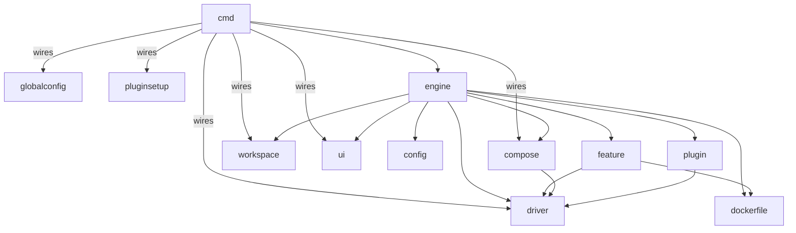

# Architecture

This document is a map for contributors. It explains how crib is laid out, what the boundaries are, and the invariants you should not break. It is deliberately short. For deep dives, see `docs/implementation-notes.md` and the per-area docs in `.agents/skills/crib-review/references/`.

## Bird's eye view

crib runs dev containers from the command line. It reads a `devcontainer.json` (with optional Docker Compose files), builds an image, creates the container, runs lifecycle hooks, and gets out of the way. There is no IDE integration, no daemon, and no agent installed inside the container. Image builds use `docker build` / `podman build` for single-container scenarios and `docker compose build` / `podman-compose build` when a compose service has a `build:` directive; everything else (hook execution, env probing, user setup, plugin file copies) happens from the host via `docker exec`.

Two scenarios drive the code shape:

- **Single container** (image or Dockerfile): crib owns the build and the `docker run` invocation.
- **Compose**: crib generates an override YAML and delegates to `docker compose up` / `podman-compose`.

These two paths run in parallel through most of the engine and converge in a single `finalize` step. Most invariants exist because of this split.

## Entry points

Start reading here, in order:

1. `main.go` -> `cmd/root.go`: cobra wiring, flag parsing, workspace lookup.
2. `cmd/up.go`: the canonical command. Calls `engine.Up`.
3. `internal/engine/engine.go` (`Up`, `Restart`, `Down`, `Remove`): the orchestration layer. Routes to `upExisting`, `upCreate`, or `upFromImage`.
4. `internal/engine/backend.go` (`containerBackend` interface, `newBackend`): the single-vs-compose fork. Implementations live in `backend_single.go` and `backend_compose.go`.
5. `internal/engine/finalize.go` (`finalize`): every creation and restart path converges here.

For other commands, `cmd/<verb>.go` is a thin wrapper around an `engine.<Verb>` method.

## Code map

```
crib/
  cmd/                 CLI surface (cobra). One file per verb.
  internal/
    config/            devcontainer.json parsing, variable substitution, merge rules
    feature/           DevContainer Features: OCI resolution, ordering, Dockerfile gen
    dockerfile/        Dockerfile parsing and rewriting
    engine/            Orchestration: Up/Down/Restart/Remove flows, lifecycle hooks
    driver/            Container runtime abstraction (single OCIDriver for Docker+Podman)
    compose/           Docker Compose / Podman Compose helper (compose-go wrapper)
    plugin/            Plugin system: codingagents, packagecache, shellhistory, ssh, dotfiles
    pluginsetup/       Plugin enable/disable wiring outside the up flow
    workspace/         Workspace state (~/.crib/workspaces/{id}/)
    globalconfig/      User-level config (~/.config/crib/config.toml) and project .cribrc loading
    ui/                Progress reporting, terminal output formatting
  docs/                Contributor docs (this file, implementation-notes, ADRs)
  website/             User-facing docs (Astro Starlight, deployed to fgrehm.github.io/crib)
  e2e/                 End-to-end tests against the built binary
  examples/            Sample devcontainers used in docs and manual testing
```

### Module relationships



`cmd` is the composition root. It loads global and project config, constructs the runtime dependencies (`OCIDriver`, workspace store, compose helper, plugin manager, UI), and injects them into `engine`. The orchestration logic itself lives in `engine`; `cmd` is wiring plus a thin per-verb wrapper. Dependency flow runs strictly downward — leaf packages never import `engine` and there are no cycles. If you find yourself wanting to import `engine` from a leaf package, the abstraction is wrong.

## Engine internals

The engine has two shapes that matter:

- **`containerBackend` interface** (`engine/backend.go`) abstracts the single-vs-compose split. Implementations: `singleBackend`, `composeBackend`. Methods: `pluginUser`, `start`, `buildImage`, `createContainer`, `deleteExisting`, `restart`, `canResumeFromStored`. The factory `newBackend` routes by `len(cfg.DockerComposeFile) > 0`.
- **`finalize` convergence** (`engine/finalize.go`): every creation or restart path ends here. Steps in order: plugin file copies, volume chown, remote user resolution, early save, lifecycle hooks (or snapshot restore), final save with probed env.

Plugin dispatch, lifecycle hooks, env wiring, and result saving live in the shared orchestration layer above the backend interface, never inside a backend implementation.

## Invariants

These are the rules a contributor could break without realizing. Most exist because of the single-vs-compose split or the no-daemon-agent stance.

- **No daemon agent inside the container.** crib does not install a sidecar, run a long-lived in-container service, or pre-bake a crib binary into the image. Setup and teardown drive the container from the host (`docker exec` for runtime steps, `docker build` for the image).
- **One driver, two runtimes.** Docker and Podman go through `OCIDriver`, not separate implementations. Runtime detection: `CRIB_RUNTIME` env > podman > docker.
- **Both paths or neither.** Anything that affects container creation (mounts, env, labels, plugins, features) must be wired into both `singleBackend` and `composeBackend`. Single uses `driver.RunOptions`; compose writes into the override YAML. The split also exists in `restart.go`.
- **Config wins.** `remoteUser` / `containerUser` from devcontainer.json are consulted before any backend-specific or generic fallback. The contract is enforced by `backend.pluginUser()` before plugin dispatch.
- **`remoteEnv` is injected, not baked.** `remoteEnv` (including plugin `PathPrepend` entries) flows into the container via `docker exec -e`, not via `ENV` in the image or `environment:` in compose. Baking it in would defeat the userEnvProbe contract.
- **State lives under `~/.crib/`.** Per-workspace state in `~/.crib/workspaces/{id}/`, derived from the project path. Container labels (`crib.workspace`, `crib.home`) tie running containers back to that state. Don't add parallel state stores.
- **Locked state-mutating commands.** Commands that mutate workspace or container state (`up`, `down`, `stop`, `rebuild`, `restart`, `remove`) acquire `store.Lock(ctx, ws.ID)` before operating. Read-only commands (`exec`, `run`, `shell`, `logs`, `status`, `list`, `doctor`) do not lock.
- **No cycles in the dependency graph.** See the diagram above.

## Cross-cutting concerns

- **Lifecycle hooks** (`engine/lifecycle.go`): the six devcontainer-spec hooks plus crib's marker-file idempotency. Object-syntax hooks run in parallel via `errgroup`.
- **Plugin dispatch** (`engine/single.go`, `engine/compose.go`, `engine/restart.go`): `dispatchPlugins` is the shared entry point; each path merges the response into its own target shape.
- **User resolution**: a multi-source fallback chain (devcontainer.json -> compose service `user:` -> Dockerfile `USER` -> base image metadata -> `whoami` in the running container). See `docs/implementation-notes.md` for the full precedence table.
- **userEnvProbe**: runs the user's login-interactive shell to capture PATH and tool-manager state, then injects the result into all subsequent `docker exec` calls. Probed twice (before and after lifecycle hooks).
- **Workspace versioning**: every workspace records the `CribVersion` that last touched it. No version-gated logic exists yet, but the field is the hook for migrations and snapshot invalidation.

## Persisted state

crib reads from two homes and writes to one. Configuration is XDG-style; runtime state is in `~/.crib/`:

```
~/.config/crib/
  config.toml              user-level config (XDG_CONFIG_HOME respected)

~/.crib/                   data home (override with $CRIB_HOME)
  feature-cache/           DevContainer Features cache (resolved OCI/HTTPS feature payloads, shared across workspaces)
  workspaces/
    {id}/
      workspace.json       workspace metadata (project path, CribVersion)
      result.json          container ID, workspace folder, remote user, probed remoteEnv
      Dockerfile           generated Dockerfile from the last build
      compose-override.yml last compose override (compose scenario only)
      hooks/               lifecycle hook idempotency markers (e.g. onCreateCommand.done)
      plugins/             per-plugin staging (coding-agents, package-cache, shell-history, ssh, dotfiles)
      .lock                exclusive lock for state-mutating commands

<project-root>/
  .cribrc                  per-project config (TOML; legacy bare-value format auto-coerced)
```

`feature-cache/` is shared across workspaces. Everything under `workspaces/{id}/` is workspace-scoped and removed by `crib remove`. `.cribrc` lives in the project tree (committed or git-ignored, user's call) and supplies defaults for flags unset on the command line.

## Where to look next

- `docs/implementation-notes.md` for quirks, workarounds, spec compliance status, and the reasoning behind specific choices (rootless Podman, UID sync, feature entrypoints, image lifecycle).
- `docs/devcontainers-spec.md` for the spec reference crib targets.
- `.agents/skills/crib-review/references/` for per-area rules: `engine.md`, `plugins.md`, `logging.md`, `docs.md`.
- `docs/decisions/` for ADRs.
- `docs/plugin-development.md` for the plugin interface and merge rules.

## Maintenance

This file is for things unlikely to change. When the dependency graph, the single-vs-compose split, or the invariants above shift, update this file. Quirks, spec status, and module internals belong elsewhere.
