# crib Plugin System

**Date:** 2026-02-28
**Status:** Draft, design only, implementation deferred

> **Note:** This spec supersedes `docs/specs/2026-02-20-crib-extensions.md`. Two of the three features described there (shared mounts, zero-config bootstrapping) are now defined as bundled plugins here. Transparent commands require subcommand plugin support, which is deferred (see [Future Considerations](#future-considerations)). When this doc is finalized, move it to `docs/plugin-system.md` and archive or delete the old extensions spec.

## Goal

Keep crib's core engine minimal (container lifecycle, config parsing, driver abstraction, workspace state) while enabling extensibility through external plugins. Plugins are standalone executables that crib discovers and calls at defined points, meaning anyone can write one in bash, Python, Go, or whatever they prefer.

Two of the three features described in the [crib extensions spec](2026-02-20-crib-extensions.md) (shared mounts, zero-config bootstrapping) would be implemented as bundled plugins rather than engine code. Transparent commands require subcommand plugin support, which is deferred.

## Principles

- **Same contract, two transports.** All plugins (bundled and user) share the same interface: same input schema, same output schema, same event model. Bundled plugins are Go code that runs in-process for efficiency. User plugins are external executables that speak the same protocol over stdin/stdout. No privileged capabilities either way: anything a bundled plugin can do, a user plugin can also do.
- **Config transformation, not arbitrary middleware.** Plugins declare what they want (extra mounts, env vars, run args). The engine merges those declarations. Plugins don't get to intercept or rewrite the full container config.
- **Stdin/stdout/stderr protocol (user plugins).** JSON in, JSON out. Bash-friendly with `jq`. No gRPC, no sockets, no daemon processes.
- **Fail-open by default.** A broken or missing plugin should warn, not block `crib up`. Users can opt into fail-closed per plugin if they want.
- **Bundled plugins are replaceable.** If you don't like the built-in `shared-mounts` behavior, disable it and write your own in bash. You get the same inputs, can emit the same outputs, and the engine treats the result identically.

## Plugin Anatomy

A plugin is an executable that lives in a known location. Minimum viable plugin:

```bash
#!/usr/bin/env bash
# ~/.crib/plugins/hello/plugin
echo '{}' # no modifications
```

A plugin MAY include a metadata file alongside the executable:

```toml
# ~/.crib/plugins/hello/plugin.toml
name = "hello"
description = "Example plugin that does nothing"
version = "0.1.0"
events = ["pre-container-run"]
```

`plugin.toml` is required for user plugins. crib reads it at discovery time to determine which events the plugin subscribes to, without executing the plugin. This avoids running untrusted code during discovery and keeps the metadata statically inspectable.

## Discovery

Plugins are discovered from two locations, in priority order:

1. **Bundled plugins** — Go code compiled into the crib binary, implementing the same plugin interface. No extraction to disk needed.
2. **User plugins** — external executables at `~/.crib/plugins/<name>/plugin` (or `~/.crib/plugins/<name>.sh` for single-file plugins), invoked over stdin/stdout.

Plugins must be explicitly enabled in configuration to run. Discovery finds them; configuration activates them.

For MVP, `crib config edit` opens `~/.config/crib/config.toml` in `$EDITOR`. If the file doesn't exist, crib creates it first with commented-out defaults (see [Config File Reference](#config-file-reference) below), so users have a template to work from rather than a blank file. A richer `crib plugin enable/disable/list` CLI can come later, the toml is the persistence layer either way.

> **Note:** Today crib only has `.cribrc` (per-project, flat `key=value`, just a `config` key). This spec introduces `~/.config/crib/config.toml` as the global user-level config. The two coexist: `.cribrc` stays for per-project overrides of CLI flags, `config.toml` is for user preferences that span all projects.

```toml
# ~/.config/crib/config.toml
[plugins.shared-mounts]
enabled = true

[plugins.shared-mounts.config]
share = ["ssh", "gitconfig"]

[plugins.shell-history]
enabled = true

[plugins.dotfiles]
enabled = true

[plugins.dotfiles.config]
repository = "https://github.com/user/dotfiles"
installCommand = "install.sh"
```

Per-project activation/configuration via `customizations.crib`:

```json
{
  "customizations": {
    "crib": {
      "plugins": {
        "shared-mounts": {
          "enabled": true,
          "share": ["ssh", "gitconfig", "apt-cache"]
        },
        "coding-agents": {
          "enabled": false
        }
      }
    }
  }
}
```

A project can both enable plugins that are globally disabled and disable plugins that are globally enabled. The `enabled` field in per-project config takes precedence over the global setting. Plugin-specific config keys (e.g., `share`) follow a simple rule: **per-project replaces global entirely** (no deep merging). This is predictable and avoids surprises with list concatenation. If a project specifies `share`, that's the full list, not an addition to the global default.

## Communication Protocol

### Input (crib to plugin)

Plugins receive context through two channels:

**Environment variables:**

| Variable | Description | Availability |
|----------|-------------|-------------|
| `CRIB_EVENT` | The event being fired (e.g., `pre-container-run`) | All events |
| `CRIB_PLUGIN_NAME` | The plugin's own name (e.g., `shared-mounts`) | All events |
| `CRIB_WORKSPACE_ID` | Workspace identifier | All events |
| `CRIB_WORKSPACE_DIR` | Path to workspace state dir (`~/.crib/workspaces/{id}/`) | All events |
| `CRIB_SOURCE_DIR` | Path to the project source on the host | All events |
| `CRIB_RUNTIME` | Container runtime (`docker` or `podman`) | All events |
| `CRIB_VERBOSE` | `1` if verbose mode is on | All events |
| `CRIB_IMAGE` | Image name being used | After config parse (not `config-generate`) |
| `CRIB_REMOTE_USER` | The container user | After config parse (not `config-generate`) |
| `CRIB_REMOTE_HOME` | Home directory of the remote user (e.g., `/home/vscode`) | Only when container exists (`post-container-create`, `post-setup`, `pre-down`) |
| `CRIB_WORKSPACE_FOLDER` | Workspace folder path inside the container | After config parse (not `config-generate`) |
| `CRIB_CONTAINER_NAME` | Container name (`crib-{workspace-id}`) | After config parse (not `config-generate`) |
| `CRIB_CONTAINER_ID` | Container ID | Only when container exists (`post-container-create`, `post-setup`, `pre-down`) |

Variables that are not available for a given event are not set (not set to empty string), so plugins can use `${CRIB_CONTAINER_ID:+...}` or `[ -n "$CRIB_CONTAINER_ID" ]` idioms.

**Stdin** (JSON, always provided):

The plugin's merged configuration (global config merged with per-project config). For the shared-mounts plugin this might be:

```json
{
  "share": ["ssh", "gitconfig", "apt-cache"]
}
```

For a plugin with no config, stdin is `{}`.

### Output (plugin to crib)

Plugins write JSON to stdout. The schema depends on the event type.

**Compose vs single containers:** Plugins don't need to know whether the workspace uses `docker run` or Docker Compose. The output schema is the same either way. The engine translates plugin output into the right form: for single containers, `mounts` and `env` become `docker run` flags; for compose, they're injected into the compose override file.

**For `pre-container-run`** (config transformation):

```json
{
  "mounts": [
    {
      "type": "bind",
      "source": "/home/user/.ssh",
      "target": "/home/devuser/.ssh",
      "readonly": true
    }
  ],
  "env": {
    "SSH_AUTH_SOCK": "/tmp/ssh-agent.sock"
  },
  "runArgs": ["--cap-add", "SYS_PTRACE"]
}
```

`mounts` and `env` are structured, portable fields that work with both single containers and compose. `runArgs` is an **escape hatch** for raw `docker run` flags that can't be expressed structurally (e.g., `--cap-add`, `--device`, `--security-opt`). Prefer `mounts`/`env` when possible. `runArgs` is **ignored for compose workspaces** (with a warning in verbose mode).

**For lifecycle events** (`post-container-create`, `post-setup`):

```json
{
  "exec": [
    {
      "command": "git clone https://github.com/user/dotfiles ~/dotfiles && ~/dotfiles/install.sh",
      "user": "vscode",
      "description": "Installing dotfiles"
    }
  ]
}
```

**For `config-generate`** (scaffolding):

The plugin returns a full devcontainer.json body. The engine writes it to `.devcontainer/devcontainer.json` and proceeds with the normal `up` flow. If multiple plugins respond to `config-generate`, the first one that returns a non-empty `config` wins (others are skipped).

```json
{
  "config": {
    "image": "mcr.microsoft.com/devcontainers/go:1",
    "customizations": {
      "crib": {
        "plugins": {
          "shared-mounts": {
            "share": ["ssh", "gitconfig"]
          }
        }
      }
    }
  }
}
```

**For events where the plugin has nothing to contribute:**

```json
{}
```

### Output Handling

**Stdout** is reserved for the protocol response (JSON). Plugins MUST NOT write anything else to stdout.

**Stderr** is the plugin's channel for user-facing messages. crib captures it and handles it based on verbosity:

- **Normal mode (`CRIB_VERBOSE=0`):** stderr is suppressed unless the plugin exits non-zero, in which case crib replays the captured stderr as a warning/error.
- **Verbose mode (`CRIB_VERBOSE=1`):** stderr is streamed through to the user in real time, prefixed with the plugin name (e.g., `[shared-mounts] Mounting ~/.ssh`).

This means plugins can freely log to stderr for debugging without cluttering normal output. The `CRIB_VERBOSE` env var is also available so plugins can adjust their own verbosity (e.g., skip expensive diagnostic output in normal mode).

**Exit codes:**

| Code | Meaning |
|------|---------|
| `0` | Success. Stdout is parsed as JSON. |
| Non-zero | Failure. Behavior depends on the plugin's fail mode (warn or abort). |

### Protocol Versioning

No version field for v1. The protocol hasn't shipped yet, so there are zero consumers to break. If the schema needs to evolve later, a `"version"` field can be added as optional. Plugins that omit it will be assumed to speak v1.

## Events

The engine fires events at defined points in the lifecycle. Plugins declare which events they care about (via metadata or config).

| Event | When | Typical use |
|-------|------|-------------|
| `pre-container-run` | Before `docker run` or `compose up`, after image is built | Inject mounts, env vars, run args |
| `post-container-create` | After container exists, before devcontainer lifecycle hooks | Clone dotfiles, one-time setup |
| `post-setup` | After all devcontainer lifecycle hooks have run | Verification, notifications |
| `pre-down` | Before container stop/remove | Cleanup, state persistence |
| `config-generate` | When no devcontainer.json exists and `crib up` is run | Zero-config bootstrapping |

### Event Idempotency

The engine manages idempotency using the same marker file mechanism as devcontainer lifecycle hooks (`~/.crib/workspaces/{id}/hooks/`):

| Event | Fires | Idempotency |
|-------|-------|-------------|
| `config-generate` | Once (no config = first run) | Naturally idempotent (config file exists after first run) |
| `pre-container-run` | Every `crib up` / `crib restart` (recreate) | No marker, fires every time |
| `post-container-create` | Once per container creation | Engine-managed marker, cleared on `crib down` / recreate |
| `post-setup` | Every `crib up` (including starts of existing containers) | No marker, fires every time |
| `pre-down` | Every `crib down` / `crib remove` | No marker, fires every time |

This means plugin authors don't need to track their own state for one-time events. The `dotfiles` plugin, for example, can unconditionally clone and install, knowing the engine won't call it again until the container is recreated.

### Lifecycle Diagram

Shows where plugin events fire relative to crib's core engine flow:

```mermaid
flowchart TD
    Start["crib up"] --> HasConfig{devcontainer.json<br/>exists?}

    HasConfig -- No --> ConfigGen["🔌 config-generate"]
    HasConfig -- Yes --> Parse
    ConfigGen --> Parse["Parse config"]

    Parse --> Init["Run initializeCommand<br/>(host)"]
    Init --> Build["Build image<br/>(if needed)"]

    Build --> PreRun["🔌 pre-container-run"]
    PreRun --> |"Merge mounts, env,<br/>runArgs from plugins"| Run["docker run /<br/>compose up"]

    Run --> PostCreate["🔌 post-container-create"]
    PostCreate --> Lifecycle["devcontainer lifecycle hooks<br/>(onCreate, postCreate,<br/>postStart, postAttach)"]

    Lifecycle --> PostSetup["🔌 post-setup"]
    PostSetup --> Ready["Container ready"]

    Down["crib down"] --> PreDown["🔌 pre-down"]
    PreDown --> Stop["Stop / remove container"]

    style ConfigGen fill:#e8f4e8,stroke:#4a9
    style PreRun fill:#e8f4e8,stroke:#4a9
    style PostCreate fill:#e8f4e8,stroke:#4a9
    style PostSetup fill:#e8f4e8,stroke:#4a9
    style PreDown fill:#e8f4e8,stroke:#4a9
```



Plugin events are highlighted in green. The core engine handles everything else.

`pre-container-run` fires on `crib restart` when the container is recreated (safe config change), since mounts and env vars from plugins need to be re-applied. This is already reflected in the idempotency table above.

**Open question:** Do we need a `pre-build` event for plugins that want to influence image building? This would let plugins inject Dockerfile instructions or build args, but it significantly complicates the contract. Deferred unless a concrete use case demands it.

## Execution Order

When multiple plugins subscribe to the same event:

1. Bundled plugins run first, then user plugins
2. Within each group, alphabetical by name (deterministic, no surprises)
3. Plugins run independently: each receives the same base context, not the accumulated output of previous plugins. The engine collects all plugin outputs and merges them after all plugins have run. If two plugins emit conflicting values for the same env var, the last one wins (per ordering above). Mounts and exec commands are appended, not deduplicated.

This keeps the model simple: plugins don't need to reason about what other plugins emitted, and the engine could parallelize execution in the future.

**Open question:** Should plugins be able to declare ordering dependencies on other plugins? Adds complexity. Probably not for v1.

## Bundled Plugins

These ship as Go code compiled into the crib binary. They implement the same plugin interface as external plugins (same inputs, same outputs, same event model) but run in-process. Any bundled plugin can be disabled and replaced by a user plugin with different behavior.

### `shared-mounts`

Injects curated host config mounts into container creation. Hooks into `pre-container-run`.

See [crib extensions spec, section 1](2026-02-20-crib-extensions.md#1-shared-host-configuration-customizationscribsharedmounts) for the full bundle list.

### `shell-history`

Persists bash/zsh history across container recreations. Hooks into `pre-container-run` to add a bind mount from `~/.crib/workspaces/{id}/shell-history` to the appropriate history file in the container. Uses existing shell detection logic.

Since `CRIB_REMOTE_HOME` is not available at `pre-container-run` time (the container doesn't exist yet), the plugin infers the home directory from `CRIB_REMOTE_USER`: `/root` for root, `/home/{user}` otherwise. This convention matches the devcontainer base images and covers the vast majority of cases.

### `dotfiles`

Clones a dotfiles repository and runs an install script after container creation. Hooks into `post-container-create`.

Config:
```toml
[plugins.dotfiles.config]
repository = "https://github.com/user/dotfiles"
targetPath = "~/dotfiles"        # default: ~/dotfiles
installCommand = "install.sh"    # default: install.sh
```

### `auto-init`

Generates a `devcontainer.json` when none exists, based on project convention detection. Hooks into `config-generate`.

See [crib extensions spec, section 2](2026-02-20-crib-extensions.md#2-zero-configuration-bootstrapping) for detection rules.

### `coding-agents`

Forwards host credentials for AI coding tools into the container so they work without re-authentication. Hooks into `pre-container-run`.

The problem: tools like Claude Code, pi-coding-agent, and others each have their own auth tokens, config dirs, and socket files on the host. Setting these up inside every devcontainer is tedious and error-prone. This plugin detects which tools are configured on the host and injects the right mounts and env vars.

Config:
```toml
[plugins.coding-agents.config]
# Explicit list, or omit to auto-detect all known tools
agents = ["claude-code", "pi-coding-agent"]
```

Per-agent behavior (built into the plugin):

| Agent | What it injects |
|-------|----------------|
| `claude-code` | Mounts `~/.claude` (config/auth), sets relevant env vars |
| `pi-coding-agent` | Mounts config dir, forwards auth tokens |

**Open question:** Some agents might use OAuth tokens with short expiry or refresh flows that assume host-side processes. Need to figure out which credentials are file-based (mount and forget) vs. which need socket forwarding or other mechanisms. Start with the simple file-based cases and expand.

**Open question:** Should this plugin also inject editor/IDE extensions or settings for these tools, or keep it strictly to auth? Leaning toward auth-only to stay focused.

## Error Handling

- Plugin executable not found: warn and skip (unless fail-closed)
- Plugin times out: kill, warn, continue (default timeout: 30s, configurable)
- Plugin exits non-zero: warn and continue (fail-open) or abort (fail-closed)
- Plugin writes invalid JSON to stdout: warn and skip that plugin's contributions
- Plugin writes nothing to stdout: treated as `{}`

Per-plugin fail mode in config:

```toml
[plugins.shared-mounts]
enabled = true
failMode = "abort"  # or "warn" (default)
```

## Filesystem Sync (Future Consideration)

For macOS/Windows hosts, bind mount performance with Docker Desktop is a known pain point. The plugin system as described here doesn't directly solve this, since filesystem sync requires a long-running background process (e.g., mutagen), not just config transformation.

Possible future approaches:
- A `background` field in plugin output that tells crib to manage a sidecar process
- A `pre-container-run` plugin that swaps bind mounts for named volumes and starts a sync daemon
- Handling this at the driver layer instead of the plugin layer

This is deferred but the event system doesn't block any of these options.

## What Plugins Cannot Do

Explicitly out of scope for v1:

- **Replace or wrap engine behavior.** Plugins add to the config, they don't intercept or override the engine's decisions.
- **Add new CLI subcommands.** `crib run`, `crib init`, etc. stay in the core for now. (See future considerations.)
- **Modify Dockerfiles or build steps.** No `pre-build` hook in v1.
- **Communicate with each other.** No inter-plugin messaging or dependency resolution.
- **Run as long-lived daemons.** Plugins are invoked, run, exit.

## Config File Reference

> **Note:** When this spec is finalized, extract this section into its own doc (e.g., `docs/config.md`) as a standalone reference. It lives here for now to keep the design self-contained during review.

Full schema for `~/.config/crib/config.toml`. This is also the template `crib config edit` generates (with values commented out):

```toml
# crib global configuration
# Location: ~/.config/crib/config.toml
# Edit with: crib config edit

# ─── General ───────────────────────────────────────────────────────

# Default container runtime. Auto-detected if not set (podman > docker).
# runtime = "podman"

# ─── Plugins ───────────────────────────────────────────────────────
# Plugins extend crib's behavior without modifying the core engine.
# Each plugin section follows the pattern:
#
#   [plugins.<name>]
#   enabled = true/false
#   failMode = "warn"    # "warn" (default) or "abort"
#   timeout = 30         # seconds, default 30
#
#   [plugins.<name>.config]
#   # Plugin-specific settings go here
#

# ── shared-mounts ──
# Injects curated host config (SSH keys, git config, caches)
# into containers. Available options: ssh, gitconfig, apt-cache,
# npmrc, pip-cache, docker-config.
#
# [plugins.shared-mounts]
# enabled = true
#
# [plugins.shared-mounts.config]
# share = ["ssh", "gitconfig"]

# ── shell-history ──
# Persists bash/zsh history across container recreations.
# History is stored in ~/.crib/workspaces/{id}/shell-history.
# No additional config needed.
#
# [plugins.shell-history]
# enabled = true

# ── dotfiles ──
# Clones a dotfiles repo into new containers and runs an install script.
#
# [plugins.dotfiles]
# enabled = true
#
# [plugins.dotfiles.config]
# repository = "https://github.com/user/dotfiles"
# targetPath = "~/dotfiles"
# installCommand = "install.sh"

# ── auto-init ──
# Generates devcontainer.json when none exists, based on project
# convention detection (go.mod -> Go image, package.json -> Node, etc.)
#
# [plugins.auto-init]
# enabled = true

# ── coding-agents ──
# Forwards host credentials for AI coding tools into containers.
# Auto-detects installed tools if agents list is omitted.
#
# [plugins.coding-agents]
# enabled = true
#
# [plugins.coding-agents.config]
# agents = ["claude-code", "pi-coding-agent"]
```

Config location follows the XDG Base Directory Specification: `~/.config/crib/config.toml` (or `$XDG_CONFIG_HOME/crib/config.toml` if set). Runtime state stays in `~/.crib/` (workspaces, plugins, hook markers).

## Future Considerations

- **Subcommand plugins:** `crib <name>` dispatching to a plugin executable (git-style). Would enable the transparent commands feature from the extensions spec.
- **Plugin CLI:** `crib plugin enable/disable/list/info` for managing plugins without hand-editing toml.
- **Plugin registry/install:** `crib plugin install <url>` to fetch and place plugins in `~/.crib/plugins/`.
- **Plugin uninstall/cleanup:** A `teardown` event that fires when a plugin is disabled or removed, giving it a chance to clean up state it left behind in `~/.crib/workspaces/*/`. For MVP, we don't care, plugins that store state just leave orphaned files.
- **Pre-build hooks:** Let plugins influence image building (inject Dockerfile layers, build args).
- **Background processes:** Let plugins declare sidecar processes that crib manages alongside the container (filesystem sync, port forwarding, etc.).
- **Plugin SDK:** A small bash library (`crib-plugin-lib.sh`) with helpers for JSON output generation, so plugins don't all need to hand-roll `jq` pipelines.

---

*Written in collaboration with Claude (Opus 4.6).*
